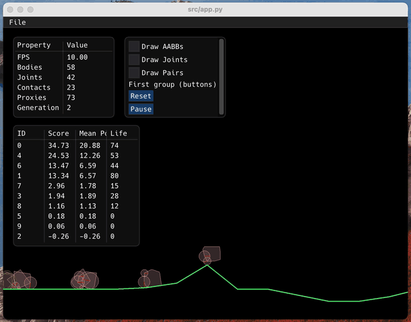

## Evolve a Car

Use genetic algorithms to evolve a car. The framework currently uses Box2D for the physics engine, pyglet for rendering and imgui for the UI. 

The code to 'evolve' the cars from generation to generation has not yet been implemented. This is a work in progress. 

Quite a lot of the code in the project is derived from the python Box2D examples.

### How to run
1. Install [Poetry](https://python-poetry.org/)
2. Install the dependencies run `poetry install`
3. On macOS follow the instructions below to fix OpenGL issues
4. Run application `poetry run src/car.py`
### Known Issues

1. On macOS Big Sur OpenGL is not found see discussion on [StackOverflow for details](https://stackoverflow.com/questions/63475461/unable-to-import-opengl-gl-in-python-on-macos).
  - Temporary Fix: 
    + Find virtual environment path `poetry show -v`
    + Open `<venvpath>/lib/OpenGL/platform/ctypesloader.py`
    + Replace line `fullName = util.find_library( name )`
    + With line `fullName = "/System/Library/Frameworks/{}.framework/{}".format(name,name)`

### Demo

### Credits 
1. [Box2D Examples](https://github.com/openai/box2d-py/tree/master/examples)
2. [Hack Font](https://github.com/source-foundry/Hack)
3. [Gidole Font](https://github.com/larsenwork/Gidole)
